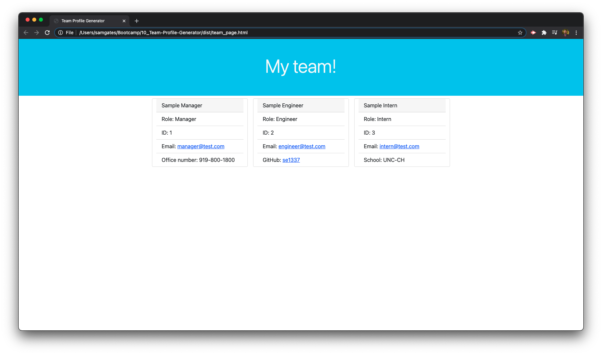
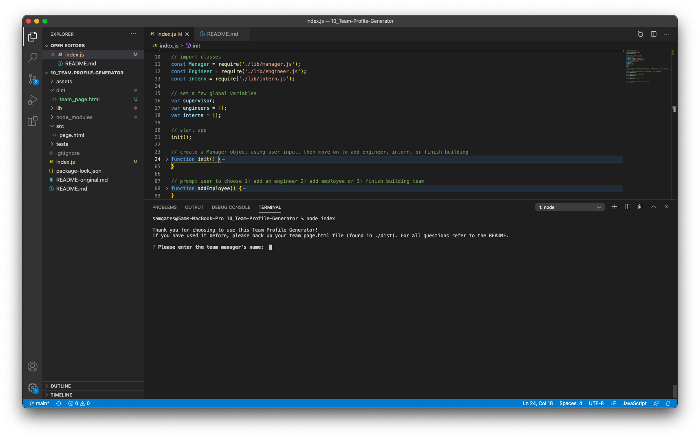

  # Team Profile Generator

  
  
  ## Description

  I created this app to quickly create a team profile page for future group projects or collaborations. It solves the issue of spending valuable time creating a simple page by generating a page from simple command line inputs. I learned how to create my own classes, and how to make recursive Inquirer prompts. 

  ## Table of Contents 
  
  - [Installation](#installation)
  - [Usage](#usage)
  - [Contribute](#contribute)
  - [Test](#test)
  - [License](#license)
  - [Questions](#questions)
  
  ## Installation

  You install the project by cloning the Github Repo, then installing Node.js and Inquirer. 
  
  ## Usage

  You use the app by following command line prompts to input the manager's information. You will then be prompted to add engineers or interns. You can add as many as you want! Once you're finished, choose that option instead of adding more employees. A file called team_page.html will be generated in the ./dist folder. 
  
  
  
  
  
  ## Contribute

  Feel free to push changes to GitHub on your own branch or simply email me!
  
  ## Test

  You test the app by running the code and comparing your input to the generated page. 
  
  ## License
  
  
  Copyright (c) Sam Gates. All rights reserved. 
  Licensed under the [GPL](https://www.gnu.org/licenses/gpl-3.0.en.html) license.
  
  ## Questions
  
  Check out my [GitHub Profile](https://github.com/sg0703).
  
  Email with questions! You can reach me at sam.j.gates@gmail.com.
  